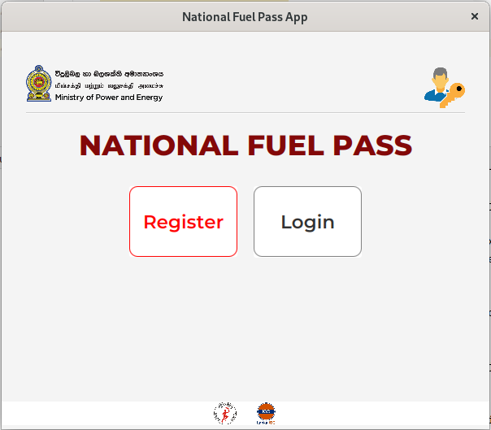
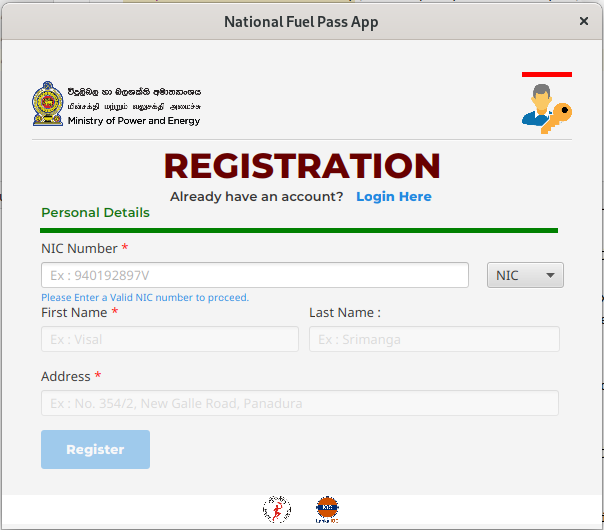
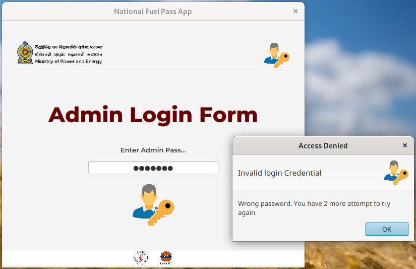

# National Fuel Pass App Clone
This is a desktop application and it is a clone version of the
existing [National Fuel Pass](https://fuelpass.gov.lk) web application. In that application
there are separate logins for both admin and other users where,
admin has the privileges to change the weekly quota of fuel and
user removal. Normal users can register and then login to the fuel
pass app.

###Languages & Tools
In this app, JavaFX was used for all user interfaces and Java was used for developed back-end logic.
    * Java
    * JavaFX

### Welcome Page
First user interface of the app as below image and navigation of the app as descriped below. 
- *Registration form by clicking "Register Button"*
- *Login form by clicking "Login Button"*
- *Admin Login by clicking "Icon" which is in Top-right corner*
- *Welcome form from anywhere of the app by clicking "Icon" which is Top-left corner*  

### Registration Form

### Admin Login Form
In this page, it will be checked the login creadentials given by admin and will return a customized JavaFX error message
for invalid login creadentials.  

### version
v1.0.0
### Licence
Copyright &copy; 2022 Visal Srimanga. All Right Reserved. 
This project is licensed under the [MIT License](LICENSE.txt)
